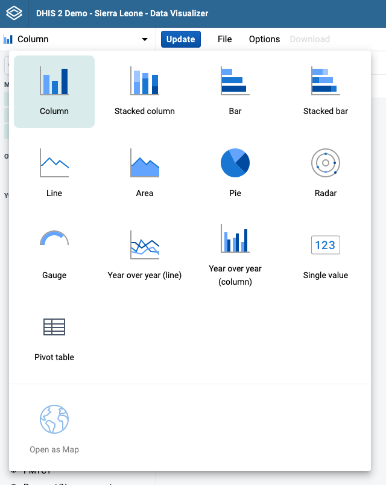
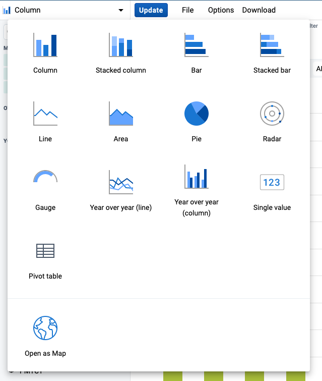

# Using the Data Visualizer app

<!--DHIS2-SECTION-ID:data_visualizer-->

## Creating and editing visualizations

When you open the data-visualizer app from the dhis2 menu, you are presented with a blank slate and you can start creating your visualization right away.

Select the desired visualization type from the selector in the upper left corner:

From the dimension menu on the left you can select the dimension you want
to show in your visualization, including data, period, organisation units and
dynamic dimensions.

You can also change the selections by clicking on the
chips in the layout area.

## Adding more axes

When combining data with different measurement scales you will get a more meaningful visualization by having more than a single axis. For "column", "bar" and "line" charts you can do so by clicking "Manage chart axes" in the Data dimension's context menu. If the option is disabled, make sure that the Data dimension is on the Series axis and that at least two items have been added.

In the axis management dialog you can assign data items to the two axes.

## Viewing visualization interpretations

When viewing a visualization, you can expand the interpretations on the right
side by clicking on the Interpretations button in the upper right corner.
The visualization description will also be shown. The description supports rich text format.

To view the visualization according to the date of a particular interpretation,
click on the interpretation or its "View" button. This will regenerate the visualization with the
relevant date, which is indicated next to the visualization title.

Clicking on "Back to all interpretations" or the "Exit View" button inside the interpretations panel will clear the
interpretation and regenerate the visualization with the current date.

## See visualization as map

Sometimes it can be useful to see how visualization would look like on map. To achieve this you can select "Open as Map" visualization type after you build your visualization.

